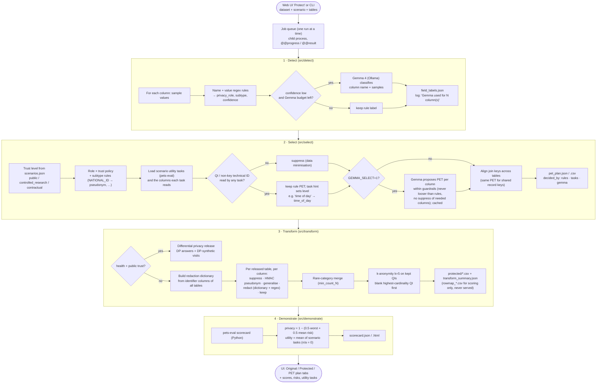

# Pipeline logic

Detect → Select → Transform → Demonstrate, run per `(dataset, scenario)`; outputs go to `out/<dataset>/<scenario>/`.

```mermaid
flowchart TD
  Start(["Web UI 'Protect' or CLI<br/>dataset + scenario + tables"]) --> Queue["Job queue (one run at a time)<br/>child process, @@progress / @@result"]
  Queue --> Detect

  subgraph Detect["1 · Detect (src/detect)"]
    D1["For each column: sample values"] --> D2["Name + value regex rules<br/>→ privacy_role, subtype, confidence"]
    D2 --> D3{"confidence low<br/>and Gemma budget left?"}
    D3 -- yes --> D4["Gemma 4 (Ollama) classifies<br/>column name + samples"]
    D3 -- no --> D5["keep rule label"]
    D4 --> D6["field_labels.json<br/>log: 'Gemma used for N column(s)'"]
    D5 --> D6
  end

  Detect --> Select

  subgraph Select["2 · Select (src/select)"]
    S1["Trust level from scenarios.json<br/>public / controlled_research / contractual"] --> S2["Role × trust policy<br/>+ subtype rules (NATIONAL_ID → pseudonym, …)"]
    S2 --> S3["Load scenario utility tasks (pets-eval)<br/>and the columns each task reads"]
    S3 --> S4{"QI / non-key technical ID<br/>read by any task?"}
    S4 -- no --> S5["suppress (data minimisation)"]
    S4 -- yes --> S6["keep rule PET; task hint sets level<br/>e.g. 'time of day' → time_of_day"]
    S5 --> S7{"GEMMA_SELECT=1?"}
    S6 --> S7
    S7 -- yes --> S8["Gemma proposes PET per column<br/>within guardrails (never looser than rules,<br/>no suppress of needed columns); cached"]
    S7 -- no --> S9
    S8 --> S9["Align join keys across tables<br/>(same PET for shared record keys)"]
    S9 --> S10["pet_plan.json / .csv<br/>decided_by: rules · tasks · gemma"]
  end

  Select --> Transform

  subgraph Transform["3 · Transform (src/transform)"]
    T0{"health + public trust?"}
    T0 -- yes --> TDP["Differential privacy release<br/>DP answers + DP-synthetic visits"]
    T0 -- no --> T1["Build redaction dictionary<br/>from identifier columns of all tables"]
    T1 --> T2["Per released table, per column:<br/>suppress · HMAC pseudonym · generalise ·<br/>redact (dictionary + regex) · keep"]
    T2 --> T3["Rare-category merge (min_count_N)"]
    T3 --> T4["k-anonymity k=5 on kept QIs<br/>blank highest-cardinality QI first"]
    T4 --> T5["protected/*.csv + transform_summary.json<br/>(rowmap_*.csv for scoring only, never served)"]
  end

  Transform --> Demonstrate

  subgraph Demonstrate["4 · Demonstrate (src/demonstrate)"]
    E1["pets-eval scorecard (Python)"] --> E2["privacy = 1 − (0.5·worst + 0.5·mean risk)<br/>utility = mean of scenario tasks (n/a = 0)"]
    E2 --> E3["scorecard.json / .html"]
  end

  Demonstrate --> Done(["UI: Original / Protected / PET plan tabs<br/>+ scores, risks, utility tasks"])
```
